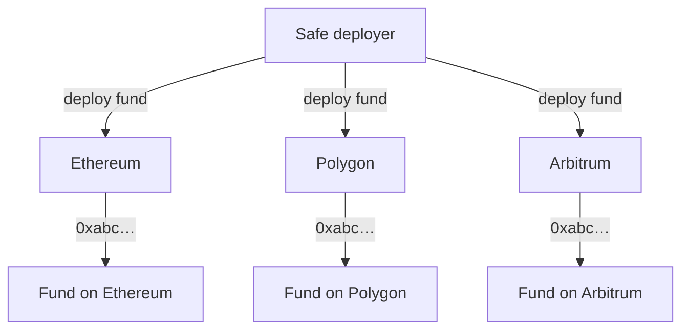

# Cross-Chain Deployment

Funds use Safe's native multi-chain infrastructure to work across networks. With deterministic deployment, a fund can launch on several blockchains at once and keep **the same address on each**.

*The networks and the `0xabc…` address above are an example.*

Combined with bridges, this design enables:

- unified fund management across networks;
- flexible capital deployment;
- a path to coordinate positions across chains as funds expand.
