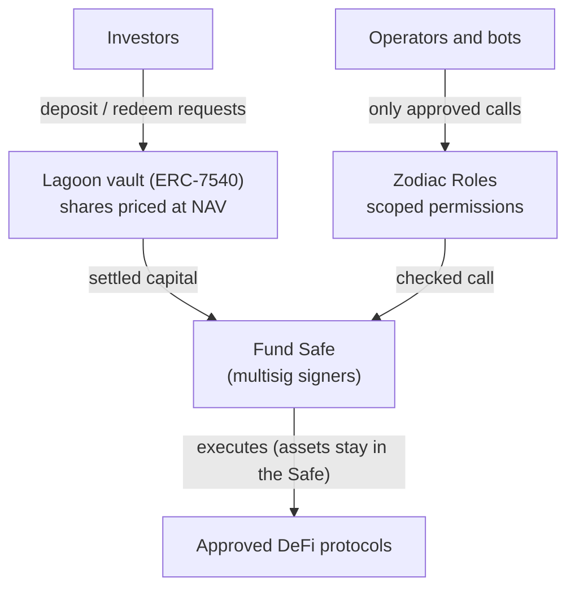
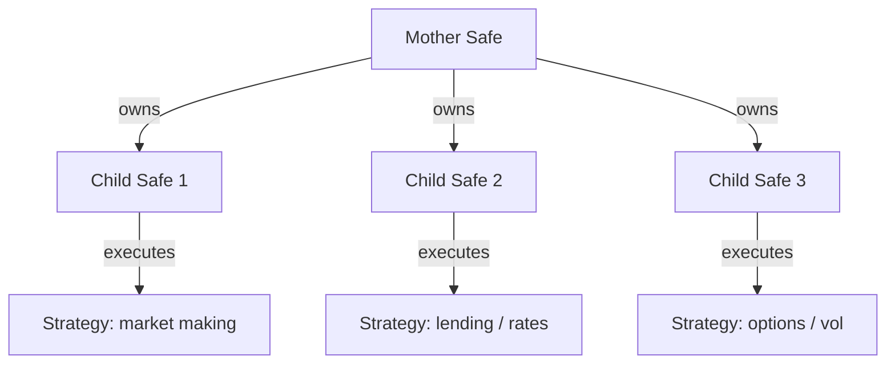
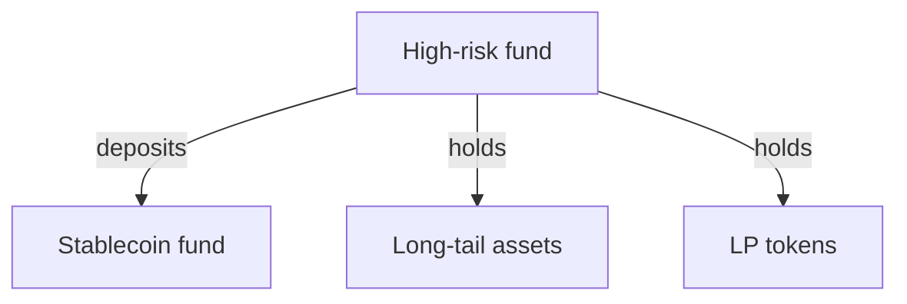

# Funds Architecture

DAMM is systems-driven, and always will be. The **DAMM Toolkit** is the stack we have built over the years to deploy and manage capital autonomously onchain, while keeping asset management non-custodial.

The toolkit combines the benefits of self-custody with the reach of DeFi, under strict security standards. We built some components in house. Others come from industry peers or were built with partners.

## How the pieces fit

Every DAMM fund has three layers: a vault that handles investors, Safes that hold the capital, and a permission layer that decides what operators can do.

- The [Lagoon Deposit Module](./lagoon-deposit-module.md) handles deposits, redemptions and share pricing.
- The fund's **Safe** holds the assets. Its signers keep control.
- The [Zodiac Roles Module](./zodiac-roles-module.md) lets operators and bots act for the Safe, but only within scoped permissions.

## Fund structures

Funds can be structured in different ways to balance risk, isolate strategies and run several strategies at once.

### Mother-child structures

One Safe (the mother) can **own** several sub-Safes (the children). Each child runs its own strategy. This gives:

- risk isolation between strategies;
- a clear separation of responsibilities.

*The strategies shown are illustrative. In DAMM's Algo funds today, each child Safe runs one isolated Uniswap LP pair.*

### Fund-to-fund structures

A fund can also deposit into another fund and receive its shares in return. For example, a high-risk fund focused on long-tail assets could park part of its capital in a low-risk stablecoin fund, for risk management or short-term liquidity.

DAMM uses this today. DAMMbtc, for example, allocates into DAMMbtcAlgo, an internal execution fund that charges no fees of its own.

Mother-child and fund-to-fund structures can be combined to build complex, multi-strategy funds.

## Components

The following pages cover each part of the DAMM Toolkit and how they connect:

- [Lagoon Deposit Module](./lagoon-deposit-module.md): async deposits and redemptions, valuation, fees and whitelisting.
- [Zodiac Roles Module](./zodiac-roles-module.md): scoped permissions for operators and bots.
- [Modular Capabilities](./modular-capabilities.md): the Safe modules a fund can combine.
- [Cross-Chain Deployment](./cross-chain-deployment.mdx): one fund address across networks.
- [Permission Helpers](./permission-helpers.md): DAMM's audited contracts that make Uniswap V4 work with Zodiac Roles.
