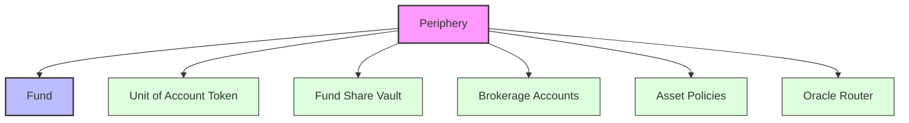
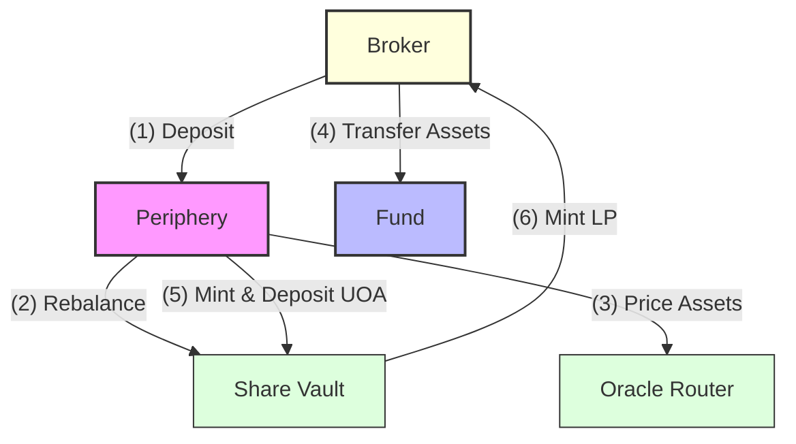
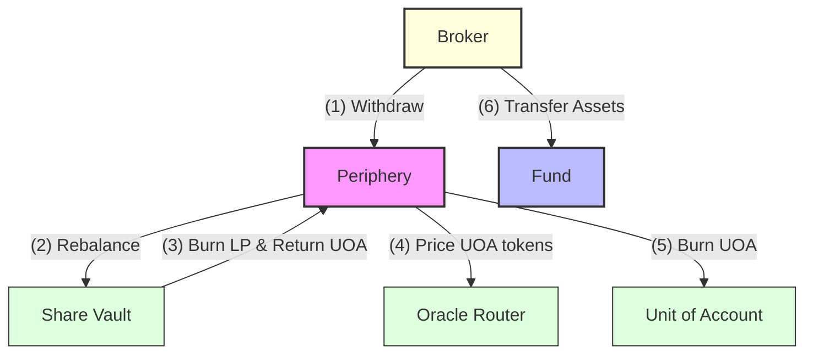
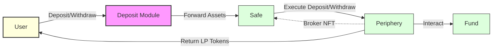

The Periphery contract (Deposit Module) is the core deposit management system for a DAMM fund. It handles asset deposits and withdrawals while maintaining a standardized unit of account across different assets. The Periphery tokenizes deposits through an ERC-4626 compliant vault system and manages broker relationships through NFT-based accounts.

Withdrawals and Deposits are supported in two ways:

**Direct Operations (Atomic)**
- User directly calls deposit/withdraw functions
- Requires user to pay gas fees
- Executed immediately on-chain

**Intent-Based Operations (Delayed Execution)**
- User signs an intent to deposit/withdraw
- Intent includes:
  - A relayer tip (paid in the deposit/withdraw asset) to incentivize execution
  - A bribe amount paid to the fund to cover potential rebalancing costs
- Third-party relayers submit the transaction on-chain
- Relayers earn the tip for covering gas costs
- Enables gasless transactions for users



## Brokers
---

Brokers are permissioned entities that can deposit and withdraw from a fund. Each broker is represented by an NFT issued by the fund administrators through the Periphery contract, which may be transferable or non-transferable. The NFT encodes the broker's:

- Permissions (transferable/non-transferable)
- Share mint limits
- Account lifetime duration
- Fee configuration
  - Performance fees
  - Entrance fees
  - Exit fees
- Asset policies
- Account state (active/paused/closed)

Brokers can:
- Deposit allowed assets (mint fund shares)
- Withdraw allowed assets (burn fund shares)
- Earn yield on deposits and share in the fund's fees

## Asset Policies
---

A Fund manages two levels of asset policies that control which assets can be deposited or withdrawn by brokers. Both global and broker-specific policies are set by the Fund through the Periphery contract.

**Global Asset Policies**
- Define the base rules for all asset interactions
- Can be used to:
  - Enable/disable specific assets
  - Set minimum deposit/withdraw amounts
  - Configure deposit/withdraw permissions

```solidity
/// @notice Global policy configuration for an asset
/// @dev Must be enabled along with broker-specific permissions for deposits/withdrawals
struct AssetPolicy {
    uint256 minimumDeposit;    // Minimum amount required for deposits
    uint256 minimumWithdrawal; // Minimum amount required for withdrawals
    bool canDeposit;           // Whether deposits are allowed
    bool canWithdraw;          // Whether withdrawals are allowed
    bool enabled;              // Whether this policy is active
}
```

**Broker-Specific Asset Policies**
- Managed per brokerage account
- Simply enable/disable specific assets for each broker
- Granular control for deposits and withdrawals

For any deposit or withdrawal to succeed:
1. The asset must be enabled in the Fund's global policy
2. The broker must have permission for that specific asset
3. The operation must meet the global policy's minimum amounts

## Deposit & Withdraw Flow
---

**Deposit Flow:**
1. Broker initiates a deposit
2. Periphery prices the fund (mark to market) and rebalances Share Vault's UOA token balance to reflect this valuation
3. Oracle Router prices the deposit in terms of UOA tokens
4. Assets are transferred to the Fund
5. Periphery mints UOA tokens and deposits them into Share Vault
6. Share Vault mints LP tokens to the broker



**Withdraw Flow:**
1. Broker initiates a withdrawal
2. Periphery prices the fund (mark to market) and rebalances Share Vault's UOA token balance to reflect this valuation
3. Share Vault burns broker's LP tokens in exchange for UOA tokens
4. Periphery prices the UOA tokens in terms of asset to withdraw
5. Periphery burns corresponding UOA tokens
6. Fund transfers assets to the broker



## Deposit Module Variants
---

Deposit Modules are user-facing contracts that provide different ways to interact with a fund's brokerage account. The architecture works as follows:

1. A Gnosis Safe is deployed
2. A Deposit Module is attached to the Safe
3. The Safe is issued a broker NFT from the fund's Periphery
4. Users can now interact with the broker NFT through the Deposit Module

This modular design allows:
- Multiple deposit modules to exist for the same fund
- Different access patterns to the same broker NFT
- Flexible user-facing interfaces while maintaining security


There are two main variants:

**Permissionless Deposit Module**
- Allows any user to deposit/withdraw through the fund
- No restrictions on who can use the module
- Useful for public-facing funds
- Example use case: Public yield aggregator

**Whitelist Deposit Module**
- Restricts deposits/withdrawals to whitelisted addresses
- Maintains an on-chain allowlist of permitted users
- Admin can add/remove users from whitelist
- Example use case: Sharing brokerage account with many addresses
