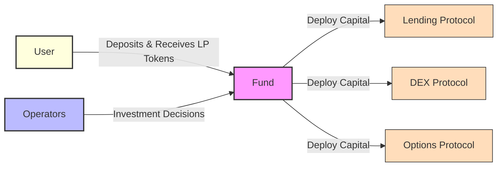
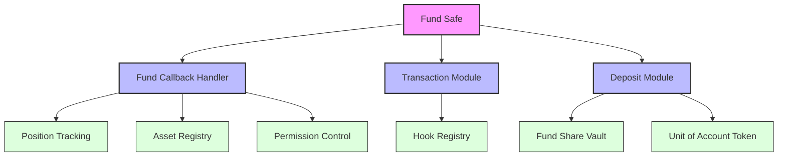
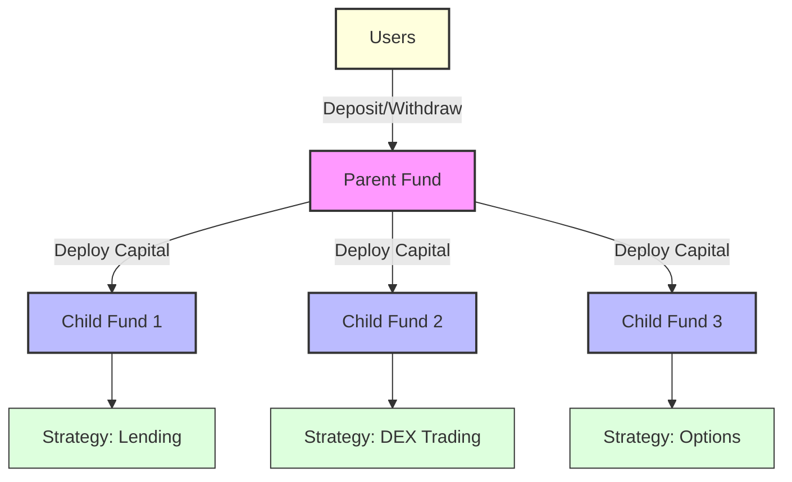
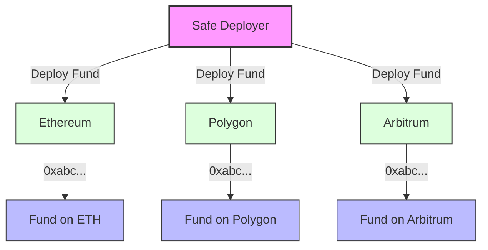

A **Fund** is the fundamental building block of the protocol. Funds pool together user deposits, tokenizing them as LP shares. Operators then deploy this capital across various DeFi protocols to generate yield for the fund's shareholders.

## Safe-Based
---

Each Fund in the DAMM Protocol is a Safe multisig smart wallet. Modules are natively added to the Safe to extend the fund's capabilities:

- **Transaction Module**: Enables permissioned transaction execution by operators, with configurable transaction hooks
- **Deposit Module (Periphery)**: Tokenizes the fund's assets by minting ERC-4626 compliant LP tokens, enabling composability with other DeFi protocols
- **Callback Handler**: Manages position tracking, permissions, and asset registry across the fund

## Hierarchical Funds
---

The DAMM Protocol uses a parent-child hierarchy to segregate investment strategies:
- **Parent Fund**: Handles capital deposits/withdrawals and distributes funds to child strategies
- **Child Funds**: Execute specific investment strategies with isolated risk

> Child funds are identical to parent funds in architecture except that they do not have a Deposit Module (Periphery). They are not intended to be used by users directly. They are only intended to be used by operators to execute investment strategies.

## Cross-Chain Capabilities
---

The DAMM Protocol leverages Safe's native cross-chain infrastructure to enable truly cross-chain investment funds. Through Safe's deterministic deployment system, funds can be launched simultaneously across multiple blockchain networks while maintaining the same address on each chain.

This cross-chain architecture, combined with bridge protocols, enables:
- Unified fund management across multiple networks
- Cross-chain capital deployment
- Cross-chain communication between funds

### Supported Networks

#### Mainnets
- Aurora
- Arbitrum
- Avalanche
- Base
- Blast
- BNB Chain
- Celo
- Ethereum
- Gnosis Chain
- Linea
- Mantle
- Optimism
- Polygon
- Polygon zkEVM
- Scroll
- World Chain
- X Layer
- zkSync Era

#### Testnets
- Base Sepolia
- Ethereum Sepolia

