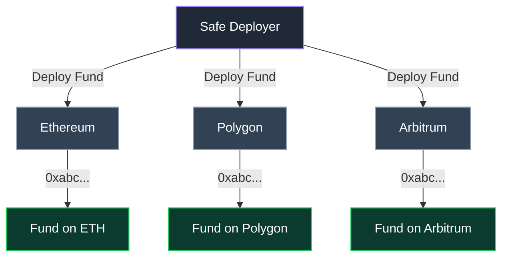

# Cross-Chain Deployment

Funds leverage Safe’s native multi-chain infrastructure to operate seamlessly across networks. Using deterministic deployment, funds can be launched simultaneously on multiple blockchains while maintaining the same address.

This cross-chain design, combined with bridges, enables:
- Unified fund management across networks  
- Flexible capital deployment  
- Secure cross-chain communication between funds  
