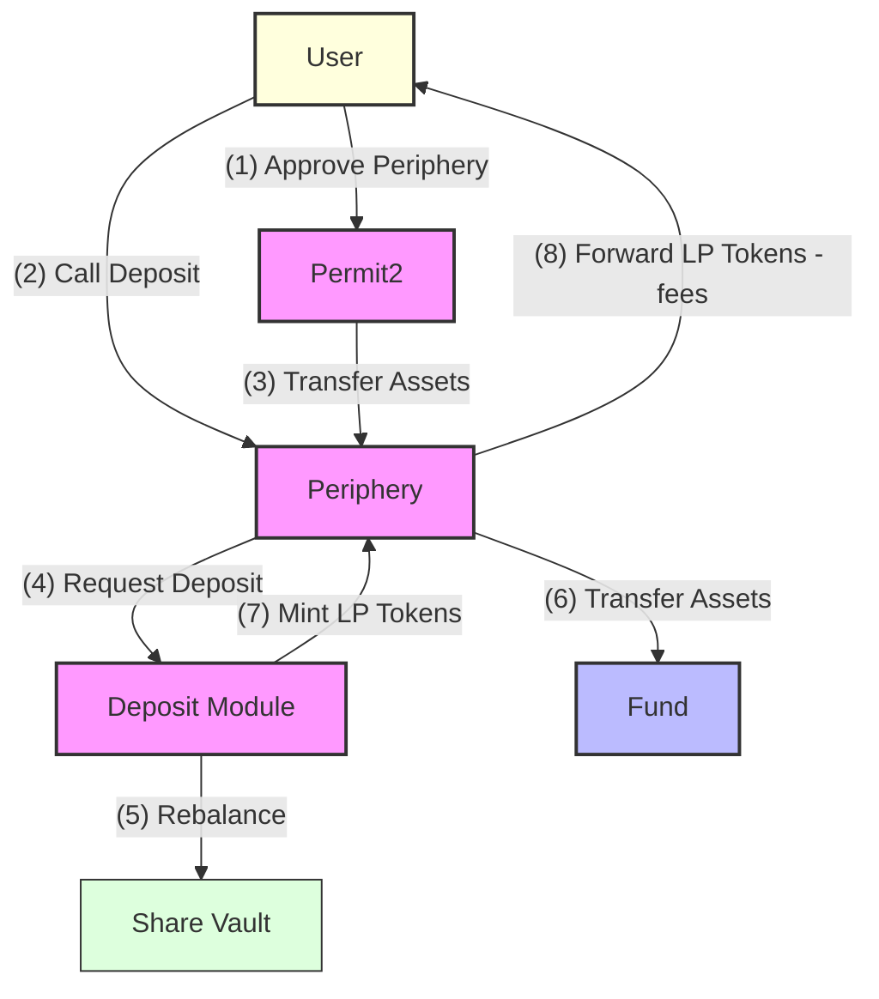
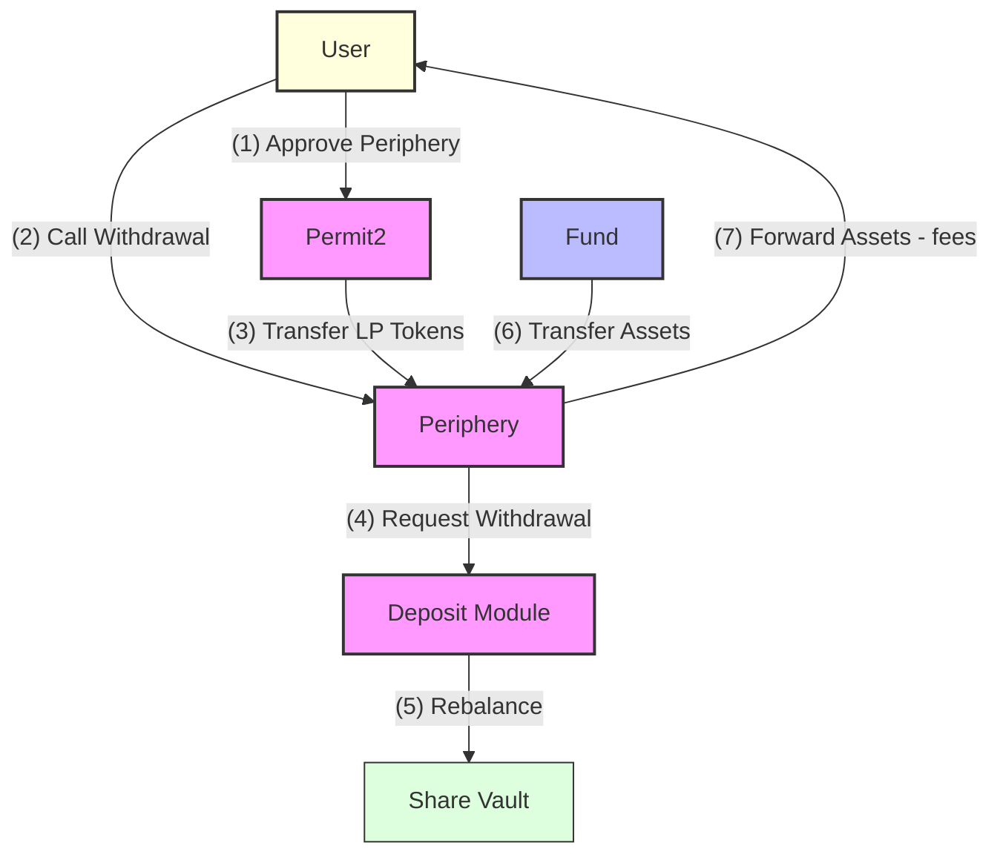

The DAMM Deposit Module is a smart contract developed by DAMM Capital, acting as the main interface between users and DAMM funds. It converts fund assets into **ERC-4626 compliant LP tokens**, enabling users to deposit and withdraw assets.

The module is built using the [Zodiac framework](https://github.com/gnosis/zodiac), the [Euler v2 Oracle Standard (ERC-7726)](https://github.com/euler-xyz/euler-price-oracle), and [Permit2](https://github.com/Uniswap/permit2). These battle-tested libraries allow the module to be extensible and composable.

Key features include:
- ERC-4626 compliant share tokens
- NFT-based brokerage account system
- Withdraw and deposits in any basket of assets
- Configurable asset policies
- Intent-based transaction support
- Flexible and composable fee structures
- Oracle network agnostic

## Repository
---

The Deposit Module source code is available in the [DAMM Contracts repository](https://github.com/DAMM-Cap/DAMM-Contracts/tree/main/src/modules/deposit).

## Deposits/Withdrawals
---

The module supports both direct (atomic) and intent-based (delayed/gasless) transactions, making it flexible for various use cases.

**Direct Operations (Atomic)**
- User directly calls deposit/withdraw functions
- Requires user to pay gas fees
- Executed immediately on-chain

**Intent-Based Operations (Delayed Execution)**
- User signs an intent to deposit/withdraw
- Intent includes:
  - A relayer tip (paid in the deposit/withdraw asset) to incentivize execution (can be zero)
  - A bribe amount paid to the fund to cover potential rebalancing costs (can be zero)
- Third-party relayers submit the transaction on-chain
- Relayers earn the tip for covering gas costs
- Enables asynchronous gasless transactions for users

## Brokers
---

Brokers are permissioned entities that can deposit and withdraw from a fund. Each broker account is represented by an NFT (ERC-721). These accounts are referred to as a **Brokerage accounts**. Brokerage accounts are issued through the Periphery contract by the fund administrators or permissioned actors. They may be transferable or non-transferable and encode the following:
- Transfer Policy (transferable/non-transferable)
- Nominal share (LP token) mint limit
- Account expiration date (can be infinite)
- Fee configuration (protocol and broker-specific)
  - Performance fee
  - Entrance fee
  - Exit fee
- Broker fee recipient
- Asset policies
- Account state (active/paused/closed)

Brokers can:
- Deposit allowed assets (mint fund shares)
- Withdraw allowed assets (burn fund shares)
- Earn yield on deposits and share in the fund's fees

> **Important:** Brokerage accounts can be `public` or `private`. Public accounts give any user access to the broker functionality (withdrawals, deposits, etc.), while private accounts restrict access to the owner of the NFT.

## Fees
---

The DAMM Deposit Module implements a dual-fee system where both the protocol and brokers can charge fees. These fees are split between the protocol fee recipient (configured by the fund) and the broker fee recipient (configured by individual brokers).

> **Important:** The broker fee structure is configured on a per-brokerage account basis at the time of issuance. The broker fee structure can **not** be changed after issuance.

> **Important:** Only the protocol management fee can be changed after issuance.

### Fee Types

1. **Management Fee**
   - An annualized rate charged on the total assets under management
   - Calculated and collected during deposits, withdrawals, or when `skimManagementFee()` is called
   - Linear fee structure based on time elapsed since last collection
   - **Protocol only - not available to brokers**

2. **Entrance Fee**
   - Charged as a percentage (in basis points) of deposit amount
   - Deducted from the shares minted to the depositor
   - **Available to both protocol and brokers**

3. **Exit Fee**
   - Charged as a percentage (in basis points) of withdrawal amount
   - Deducted from the assets returned to the withdrawer
   - **Available to both protocol and brokers**

4. **Performance Fee**
   - Charged on positive performance only
   - Calculated based on the difference between realized share price and broker's average entry price (high water mark)
   - Collected during withdrawals
   - **Available to both protocol and brokers**


### Fee Stacking

Fees from both the protocol and broker are additive. For example:
- If broker entrance fee is 50 BPs and protocol entrance fee is 50 BPs, the total entrance fee for deposits through this broker is 100 BPs
- The same additive principle applies to exit and performance fees
- All fees are capped to ensure total fees (broker + protocol) cannot exceed 100%

## Asset Policies
---

A Fund manages two levels of asset policies that control which assets can be deposited or withdrawn by brokers. Both global and broker-specific policies are set by the Fund through the Periphery contract.

### Global Asset Policies
- Define the base rules for all asset interactions
- Can be used to:
  - Enable/disable specific assets
  - Set minimum deposit/withdraw amounts
  - Configure deposit/withdraw permissions

```solidity
/// @notice Global policy configuration for an asset
/// @dev Must be enabled along with broker-specific permissions for deposits/withdrawals
struct AssetPolicy {
    uint256 minimumDeposit;    // Minimum amount required for deposits
    uint256 minimumWithdrawal; // Minimum amount required for withdrawals
    bool canDeposit;           // Whether deposits are allowed
    bool canWithdraw;          // Whether withdrawals are allowed
    bool enabled;              // Whether this policy is active
}
```

### Broker-Specific Asset Policies
- Managed per brokerage account
- Simply enable/disable specific assets for each broker
- Granular control for deposits and withdrawals

For any deposit or withdrawal to succeed:
1. The asset must be enabled in the Fund's global policy
2. The broker must have permission for that specific asset
3. The operation must meet the global policy's minimum amounts

## Deposit Flow
---

The deposit process involves multiple steps across the Periphery and Deposit Module contracts:

1. **User Initiates Deposit**
   - User approves allowance to Periphery via Permit2
   - User calls deposit function on Periphery contract

2. **Periphery Asset Transfer**
   - Periphery contract pulls assets from user
   - Assets are temporarily held by Periphery

3. **Deposit Module Interaction**
   - Periphery calls deposit function on Deposit Module

4. **Internal Vault Rebalancing**
   - Deposit Module prices all fund assets (mark-to-market)
   - Internal Share Vault is rebalanced using Unit of Account tokens
   - Ensures vault balance matches fund's mark-to-market value

5. **Asset Pricing**
   - Deposit Module prices deposited assets in terms of Unit of Account tokens

6. **Asset and Token Management**
   - Deposit Module pulls assets from Periphery to Fund
   - Mints corresponding Unit of Account tokens
   - Deposits Unit of Account tokens into vault
   - Receives LP tokens, which are sent to Periphery

7. **Final Distribution**
   - Periphery forwards LP tokens to user after applying fees
   - Transaction completes



## Withdraw Flow
---

The withdrawal process follows a similar but inverse pattern to deposits:

1. **User Approval & Initiation**
   - User grants Permit2 allowance for LP tokens
   - User initiates withdrawal transaction

2. **Share Transfer**
   - Periphery pulls LP tokens from user via Permit2

3. **Withdrawal Processing**
   - Deposit Module marks fund assets to market
   - Rebalances internal vault with Unit of Account tokens
   - Management fee is collected

4. **Asset Return**
   - LP tokens are burned for Unit of Account tokens
   - Unit of Account tokens are burned for assets
   - Fund transfers assets to Periphery

5. **Distribution**
   - Periphery forwards assets to user after fees



## Oracles
---

The DAMM Protocol uses the [Euler v2 Oracle Standard (ERC-7726)](https://github.com/euler-xyz/euler-price-oracle) for fund valuation. The system consists of two main components: The Oracle Router and Oracle Adapters.

Oracle adapters are high-level wrappers that standardize price feeds from various oracle providers into a common interface. Each adapter is a minimal, immutable contract that queries a specific external price feed, serving as the atomic building blocks of the oracle system. A collection of production-ready adapters can be found in the [Euler Price Oracle repository](https://github.com/euler-xyz/euler-price-oracle/tree/master/src/adapter).

The [EulerRouter](https://github.com/euler-xyz/euler-price-oracle/blob/master/src/EulerRouter.sol) acts as a central registry and resolver for oracle price feeds. It can register oracle adapters for specific asset pairs, resolve complex pricing paths by chaining multiple oracles together, support ERC4626 vault share pricing via `convertToAssets`, and fall back to alternative oracles if primary ones are unavailable. This allows protocols to obtain prices for any asset pair, as long as the required oracle adapters are registered in its configuration.

The DAMM Toolkit leverages already existing adapters created by peers but also provides a few custom adapters.

### Balance Of Oracle
---

A specialized oracle adapter that aggregates and values multiple token balances. The Balance Of Oracle:
1. Maintains a list of asset-holder pairs to monitor
2. Fetches current balances for each asset-holder pair
3. Prices each balance using the oracle router
4. Returns the total value in the requested quote currency

The Balance Of Oracle supports both ERC20 tokens and native assets, with a dynamically updatable balance list managed by the owner. For gas optimization, zero-value balances are automatically skipped during processing.

This oracle is essential for mark-to-market valuations, enabling accurate fund valuation across multiple assets and addresses.

### Trusted Rate Oracle
---

A permissioned oracle adapter that provides discretionary pricing for assets that are challenging to price on-chain. The Trusted Rate Oracle:
1. Maintains a fixed exchange rate between two assets
2. Includes rate expiration timestamps for staleness checks
3. Requires owner permission to update rates
4. Supports decimal conversion between assets

The Trusted Rate Oracle is designed to handle scenarios where traditional on-chain price discovery is impractical or impossible. It excels at pricing complex derivative positions like structured products and options, providing rates for illiquid or off-chain assets, and managing prices for synthetic or composite assets that lack direct market equivalents.

This oracle assumes the admin is a trusted actor since they have unilateral control over setting prices and validity timeframes. However, the system can be made more trustless by pushing the trust assumption up the stack through various mechanisms. This could involve implementing a commit-reveal scheme for price submissions, delegating admin control to an incentivized solver network, utilizing a multi-party computation (MPC) system, or requiring multiple independent price attestations.