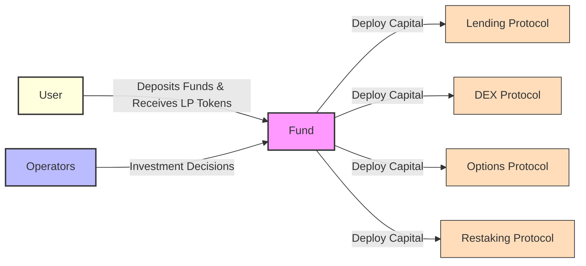
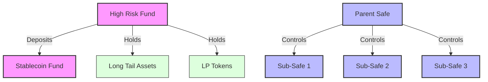
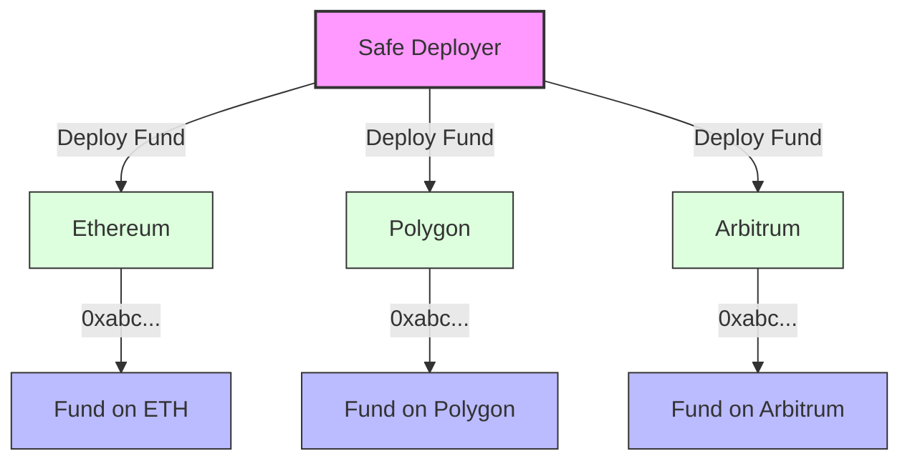

A **Fund** is the fundamental building block of DAMM. Each Fund is a [Gnosis Safe smart wallet](https://docs.safe.global/home/what-is-safe). The term Fund and Safe can be used interchangeably.

Funds are investment vehicles that pool together user deposits, tokenizing them as LP shares. Operators then deploy this capital across various DeFi protocols to generate yield or utility for in the interest of the shareholders.

## Module-Based Architecture
---
 
 Funds are designed to be modular, allowing for a wide range of capabilities to be added. Capabilities are added as modules to the fund. Modules are smart contracts that natively extend the underlying Safe contract. Some common examples include:

- **DAMM Deposit Module**: Tokenizes the fund's assets by minting ERC-4626 compliant LP tokens, enabling users to deposit and withdraw assets from the fund. This LP token is composable with other DeFi protocols. See [DAMM Contracts](https://github.com/DAMM-Cap/DAMM-Contracts) for more information.
- **Zodiac Roles Module**: Enables permissioned transaction execution by operators, with configurable transaction hooks. See [Zodiac Roles Module](https://www.zodiac.wiki/documentation/roles-modifier) for more information.
- **Palmera Safe Module**: Enables a fund to be configured in a parent-child hierarchy where a paret fund manages multiple sub-Safes. See [Palmera Safe Module](https://docs.palmeradao.xyz/palmera-module-safe-hierarchical-structure) for more information.

> There are many more modules that can be mixed and matched to extend a fund's capabilities. 

## Hierarchical Funds
---

DAMM Funds are designed to be standalone investment vehicles that can be interconnected in various ways:

- **Fund-to-Fund Investments**: Funds can deposit capital into other funds, receiving LP tokens in return. For example, a high-risk fund focusing on long-tail assets might allocate a portion of its capital to a low-risk stablecoin fund for risk management.

- **Parent-Child Structure**: Using the [Palmera Safe module](https://docs.palmeradao.xyz/palmera-module-safe-hierarchical-structure), funds can be configured in a parent-child hierarchy where a root Safe manages multiple sub-Safes, enabling:
  - Better risk encapsulation through isolation
  - Cleaner separation of responsibilities across different strategies

## Cross-Chain Capabilities
---

The DAMM leverages Safe's native cross-chain infrastructure to enable truly cross-chain investment funds. Through Safe's deterministic deployment system, funds can be launched simultaneously across multiple blockchain networks while maintaining the same address on each chain.

This cross-chain architecture, combined with bridge protocols, enables:
- Unified fund management across multiple networks
- Cross-chain capital deployment
- Cross-chain communication between funds

### Supported Networks

#### Mainnets
- Aurora
- Arbitrum
- Avalanche
- Base
- Blast
- BNB Chain
- Celo
- Ethereum
- Gnosis Chain
- Linea
- Mantle
- Optimism
- Polygon
- Polygon zkEVM
- Scroll
- World Chain
- X Layer
- zkSync Era

#### Testnets
- Base Sepolia
- Ethereum Sepolia

