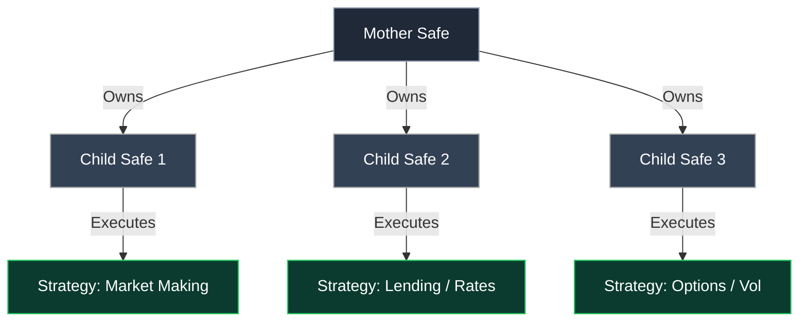
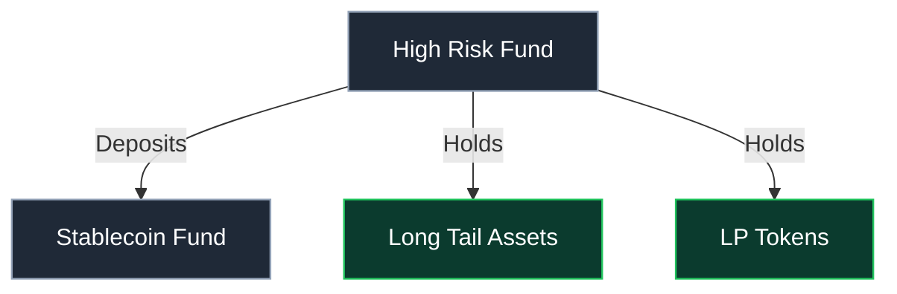

# Fund Architecture

Funds in DAMM can be structured in different ways to balance risk, isolate strategies, and enable multi-strategy management.

## Mother-Child Structures

Funds can be organized in a mother-child hierarchy where one Safe (mother) **owns** multiple sub-Safes (children). This enables:
- Risk isolation across strategies  
- Clear separation of responsibilities  

## Fund-to-Fund Structures

Funds can also deposit capital into other funds, receiving LP tokens in return. For example, a high-risk fund focusing on long-tail assets might allocate a portion of its capital to a low-risk stablecoin fund for risk management or liquidity.

> Combining mother-child and fund-to-fund structures enables complex, multi-strategy fund design.
