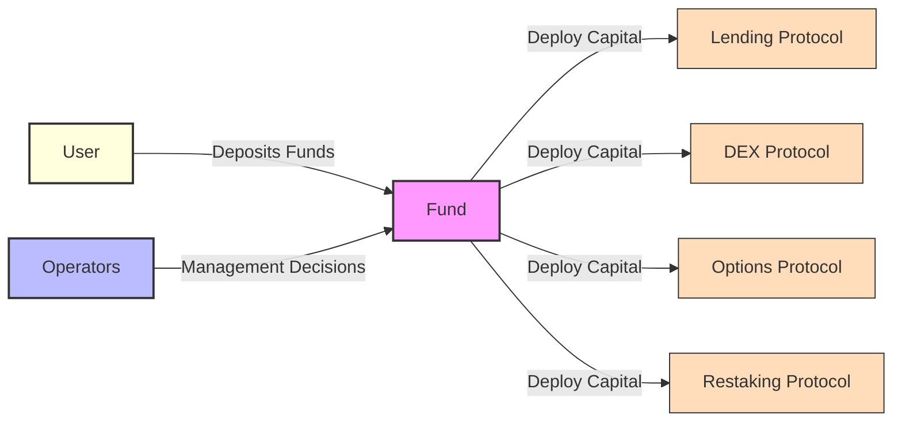
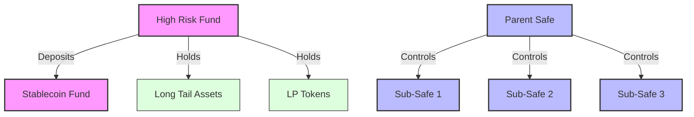
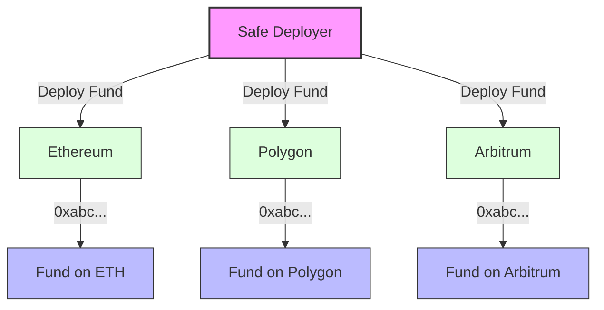

A **Fund** is the core building block of the DAMM toolkit. Technically, a fund is a [Gnosis Safe smart wallet](https://docs.safe.global/home/what-is-safe), meaning the terms *Fund* and *Safe* can be used interchangeably. Funds are investment vehicles that pool together capital from shareholders to be managed by operators, who deploy it across various DeFi protocols to generate yield or utility.

A fund can have various use cases, including: 
- Treasury Management
- Protocol Owned Liquidity (POL)
- Structured Yield Products
- Market Making
- Private Equity Vehicles
- and more...

## Module-Based Architecture
---

 Funds are modular, enabling various capabilities to be added as needed. These capabilities are integrated as modules—smart contracts that natively extend the Safe smart wallet. Some modules we like to use are:

- **DAMM Deposit Module**: Enables users to deposit and withdraw assets from the fund, issuing ERC-4626 compliant LP tokens in return. See [Deposit Module](./deposit_module.md) for more information.
- **Zodiac Roles Module**: Enables permissioned transaction execution by operators on behalf of the fund. Allows for varying levels of access through the use of roles. See [Zodiac Roles Module](https://www.zodiac.wiki/documentation/roles-modifier) for more information.
- **Palmera Safe Module**: Enables funds to be configured in a parent-child hierarchy where a parent fund directs the management of multiple child funds. See [Palmera Safe Module](https://docs.palmeradao.xyz/palmera-module-safe-hierarchical-structure) for more information.

> There are many more modules that can be mixed and matched to extend a fund's capabilities. 

## Hierarchical Funds
---

DAMM Funds are designed to be standalone investment vehicles but can be interconnected in various ways:

- **Fund-to-Fund**: Funds can deposit capital into other funds, receiving LP tokens in return. For example, a high-risk fund focusing on long-tail assets might allocate a portion of its capital to a low-risk stablecoin fund for risk management.

- **Parent-Child**: Using the [Palmera Safe module](https://docs.palmeradao.xyz/palmera-module-safe-hierarchical-structure), funds can be configured in a parent-child hierarchy where a root Safe manages multiple sub-Safes, enabling:
  - Better risk encapsulation through isolation
  - Cleaner separation of responsibilities across different strategies

> A combination of both fund-to-fund and parent-child fund structures can be used to create a complex, multi-strategy fund structure.

## Cross-Chain Capabilities
---

Funds leverage Safe's native multi-chain infrastructure to enable truly cross-chain investment vehicles. Through Safe's deterministic deployment system, funds can be launched simultaneously across multiple blockchain networks while maintaining the same address on each chain.

This cross-chain architecture, combined with bridge protocols, enables:
- Unified fund management across multiple networks
- Cross-chain capital deployment
- Cross-chain communication between funds

### Supported Networks

#### Mainnets
- Aurora
- Arbitrum
- Avalanche
- Base
- Blast
- BNB Chain
- Celo
- Ethereum
- Gnosis Chain
- Linea
- Mantle
- Optimism
- Polygon
- Polygon zkEVM
- Scroll
- World Chain
- X Layer
- zkSync Era

#### Testnets
- Base Sepolia
- Ethereum Sepolia