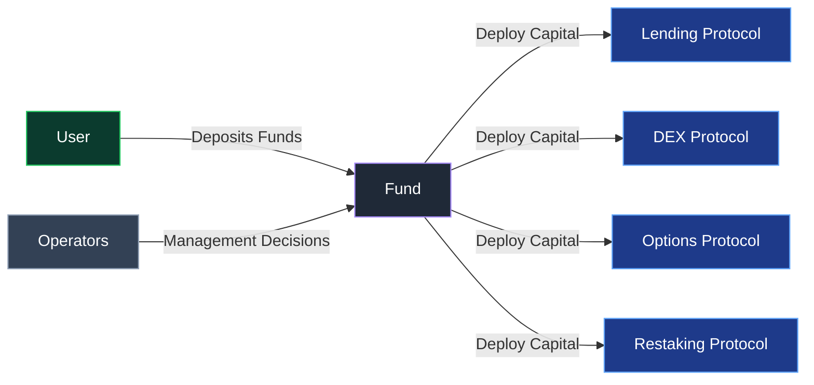
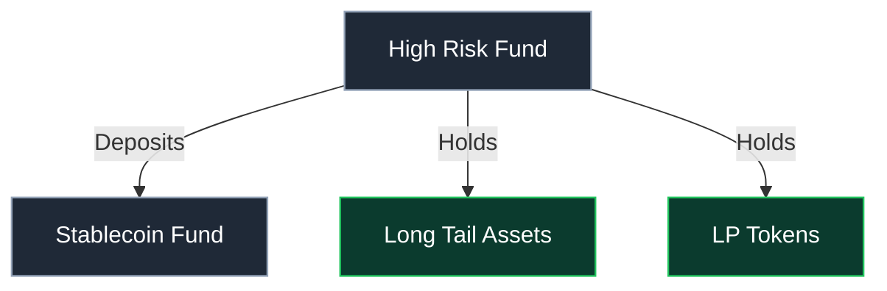
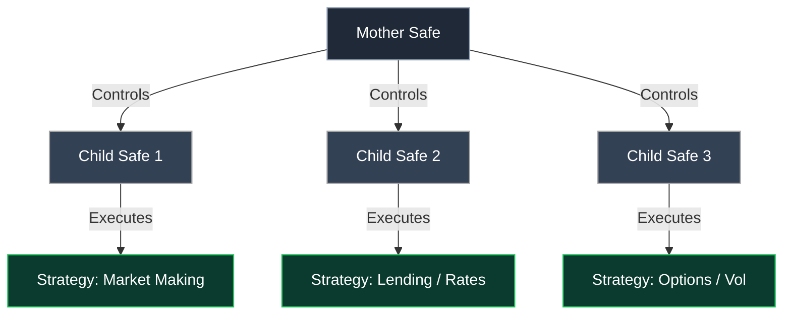
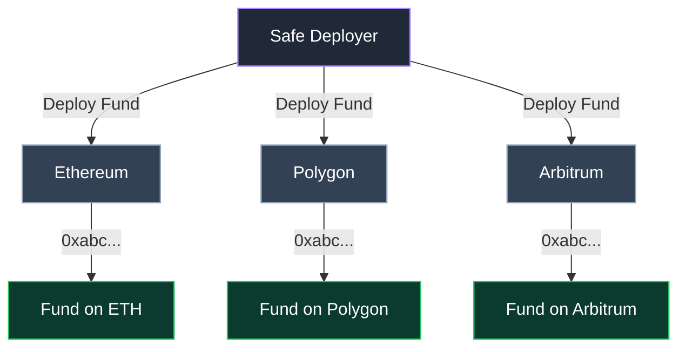

A **Fund** is the core building block of the DAMM toolkit. Technically, a fund is a [Gnosis Safe smart wallet](https://docs.safe.global/home/what-is-safe), meaning the terms *Fund* and *Safe* can be used interchangeably. Funds are investment vehicles that pool together capital from shareholders to be managed by operators, who deploy it across various DeFi protocols to generate yield or utility.

```mermaid
graph LR
    %% User Deposit Flow
    U[User] -->|Deposits Funds| F[Fund]
    
    %% Operator Management
    O[Operators] -->|Management Decisions| F
    
    %% Investment Flow
    F -->|Deploy Capital| P1[Lending Protocol]
    F -->|Deploy Capital| P2[DEX Protocol]
    F -->|Deploy Capital| P3[Options Protocol]
    F -->|Deploy Capital| P4[Restaking Protocol]
    
    %% Styling (dark-mode + light-mode friendly)
    classDef user fill:#0b3b2e,stroke:#22c55e,color:#ffffff,stroke-width:1.2px
    classDef fund fill:#1f2937,stroke:#a78bfa,color:#ffffff,stroke-width:1.2px
    classDef operator fill:#334155,stroke:#94a3b8,color:#ffffff,stroke-width:1.2px
    classDef protocol fill:#1e3a8a,stroke:#60a5fa,color:#ffffff,stroke-width:1.2px
    
    class U user
    class F fund
    class O operator
    class P1,P2,P3,P4 protocol
```

A fund can have various use cases, including: 
- Treasury Management
- Protocol Owned Liquidity (POL)
- Structured Yield Products
- Market Making
- Private Equity Vehicles
- and more...

## Module-Based Architecture
---

Funds are modular, enabling various capabilities to be added as needed. These capabilities are integrated as modules—smart contracts that natively extend the Safe smart wallet. Some modules we use are:

- **Lagoon Deposit Module**: Built by [Lagoon Finance](https://lagoon.finance), this module allows users to deposit and withdraw assets from the fund. It tokenizes the holdings of a Safe into an [ERC-7540](https://eips.ethereum.org/EIPS/eip-7540) compliant token, standardizing the way shares of the fund are issued and redeemed. See [Lagoon Docs](https://docs.lagoon.finance/overview/lagoon-vault-architecture) for more information.
- **Zodiac Roles Module**: Enables permissioned transaction execution by operators on behalf of the fund. Allows for varying levels of access through the use of roles. See [Zodiac Roles Module](https://www.zodiac.wiki/documentation/roles-modifier) for more information.
- **Zodiac Delay Module**: Introduces a time delay for executing specific transactions. This is particularly important for high-security administrative actions such as upgrading the fund or modifying its configuration. By enforcing a mandatory delay, it gives stakeholders time to review and, if necessary, react before critical changes are finalized. See [Zodiac Delay Module](https://www.zodiac.wiki/documentation/delay-modifier) for more information.

> There are many more modules that can be combined to extend a fund's capabilities.

## Hierarchical Funds
---

DAMM Funds are designed to be standalone investment vehicles but can be interconnected in various ways:

- **Fund-to-Fund**: Funds can deposit capital into other funds, receiving LP tokens in return. For example, a high-risk fund focusing on long-tail assets might allocate a portion of its capital to a low-risk stablecoin fund for risk management or short-term liquidity.

```mermaid
graph TD
    %% Fund-to-Fund Investment (dark-mode friendly)
    F1[High Risk Fund] -->|Deposits| F2[Stablecoin Fund]
    F1 -->|Holds| A1[Long Tail Assets]
    F1 -->|Holds| A2[LP Tokens]

    %% Styling (dark-mode friendly)
    classDef fund fill:#1f2937,stroke:#94a3b8,color:#ffffff,stroke-width:1.2px
    classDef asset fill:#0b3b2e,stroke:#22c55e,color:#ffffff,stroke-width:1.2px

    class F1,F2 fund
    class A1,A2 asset
```

- **Mother-Child**: Funds can be structured in a mother-child hierarchy where one Safe (mother) directly owns and manages multiple sub-Safes (children), enabling:
  - Better risk encapsulation through isolation
  - Cleaner separation of responsibilities across different strategies

```mermaid
graph TD
    %% Mother-Child Structure with Per-Sub-Safe Strategies
    MS[Mother Safe] -->|Controls| S1[Child Safe 1]
    MS -->|Controls| S2[Child Safe 2]
    MS -->|Controls| S3[Child Safe 3]

    %% Each Child Safe runs an isolated strategy
    S1 -->|Executes| STR1[Strategy: Market Making]
    S2 -->|Executes| STR2[Strategy: Lending / Rates]
    S3 -->|Executes| STR3[Strategy: Options / Vol]

    %% Styling (dark-mode friendly)
    classDef mother fill:#1f2937,stroke:#94a3b8,color:#ffffff,stroke-width:1.2px
    classDef child fill:#334155,stroke:#a3a3a3,color:#ffffff,stroke-width:1.2px
    classDef strategy fill:#0b3b2e,stroke:#22c55e,color:#ffffff,stroke-width:1.2px

    class MS mother
    class S1,S2,S3 child
    class STR1,STR2,STR3 strategy
```

> A combination of both fund-to-fund and mother-child fund structures can be used to create a complex, multi-strategy fund structure.

## Cross-Chain Capabilities
---

Funds leverage Safe's native multi-chain infrastructure to enable truly cross-chain investment vehicles. Through Safe's deterministic deployment system, funds can be launched simultaneously across multiple blockchain networks while maintaining the same address on each chain.

```mermaid
graph TD
    %% Safe Deployer
    D[Safe Deployer] -->|Deploy Fund| C1[Ethereum]
    D -->|Deploy Fund| C2[Polygon]
    D -->|Deploy Fund| C3[Arbitrum]
    
    %% Resulting Funds with Same Address
    C1 -->|0xabc...| F1[Fund on ETH]
    C2 -->|0xabc...| F2[Fund on Polygon]
    C3 -->|0xabc...| F3[Fund on Arbitrum]

    %% Styling (dark-mode + light-mode friendly)
    classDef deployer fill:#1f2937,stroke:#a78bfa,color:#ffffff,stroke-width:1.2px
    classDef chain fill:#334155,stroke:#94a3b8,color:#ffffff,stroke-width:1.2px
    classDef fund fill:#0b3b2e,stroke:#22c55e,color:#ffffff,stroke-width:1.2px

    class D deployer
    class C1,C2,C3 chain
    class F1,F2,F3 fund

```

This cross-chain architecture, combined with bridge protocols, enables:
- Unified fund management across multiple networks
- Cross-chain capital deployment
- Cross-chain communication between funds

### Supported Networks

#### Mainnets
- Aurora
- Arbitrum
- Avalanche
- Base
- Blast
- BNB Chain
- Celo
- Ethereum
- Gnosis Chain
- Linea
- Mantle
- Optimism
- Polygon
- Polygon zkEVM
- Scroll
- World Chain
- X Layer
- zkSync Era

#### Testnets
- Base Sepolia
- Ethereum Sepolia