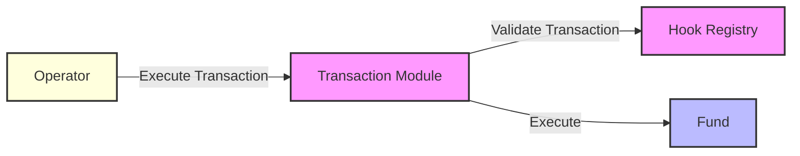

The Transaction Module is a Safe module that enables permissioned transaction execution with hook-based validation. It allows operators to execute transactions through the fund while enforcing security checks and protocol rules.



## Hook System
---

The Transaction Module uses hooks to validate and track transactions. Hooks add permissions and before/after effects to specific **routes**, where a route is uniquely identified by:
- Target address (the contract being called)
- Function signature (the specific function being executed)
- Operation type (call or delegatecall)
- Operator (the address initiating the transaction)

Hooks are standalone contracts that implement standardized interfaces (`IBeforeTransaction` and/or `IAfterTransaction`), allowing the protocol to be extended without modifying core contracts.

```solidity
interface IBeforeTransaction {
    function checkBeforeTransaction(
        address target,      // The contract being called
        bytes4 selector,     // Function signature being called on target
        uint8 operation,     // Operation type (0=Call, 1=DelegateCall)
        uint256 value,       // Native token value being sent
        bytes calldata data  // Full calldata for the transaction
    ) external;
}

interface IAfterTransaction {
    function checkAfterTransaction(
        address target,          // The contract being called
        bytes4 selector,         // Function signature being called on target
        uint8 operation,         // Operation type (0=Call, 1=DelegateCall)
        uint256 value,           // Native token value being sent
        bytes calldata data,     // Full calldata for the transaction
        bytes calldata returnData // Data returned from the transaction
    ) external;
}
```

Each hook is an independent contract that can be:
- Deployed separately from the core protocol
- Updated without affecting other components
- Configured per operator and target contract for each fund
- Added, removed or paused by fund administrators

#### Built-in Hooks

The protocol includes several pre-built hooks for common DeFi integrations:

1. **Token Transfer Hook**
   - Validates token transfers between addresses
   - Used for parent-child fund transfers or generic token transfers

2. **Vault Connector Hook**
   - Enables deposits/withdrawals between parent funds vaults
   - Manages cross-fund investments
   - Validates vault interactions

3. **Protocol Integration Hooks**
   - Aave V3 (`src/hooks/aaveV3/AaveV3CallValidator.sol`): Validates lending operations
   - Uniswap V3 (`src/hooks/uniswapV3/UniswapV3CallValidator.sol`): Validates liquidity provisioning and trading operations

#### Example: Hook Configuration

```solidity
hookRegistry.setHooks(
    HookConfig({
        operator: operator,
        target: address(aaveV3Pool),
        beforeTrxHook: address(aaveV3CallValidator),
        afterTrxHook: address(aaveV3PositionManager),
        operation: 0,
        targetSelector: aaveV3Pool.supply.selector
    })
);
```

This configuration:
1. Validates supply and borrow operations before execution
2. Tracks position changes after execution
3. Ensures only authorized assets are used